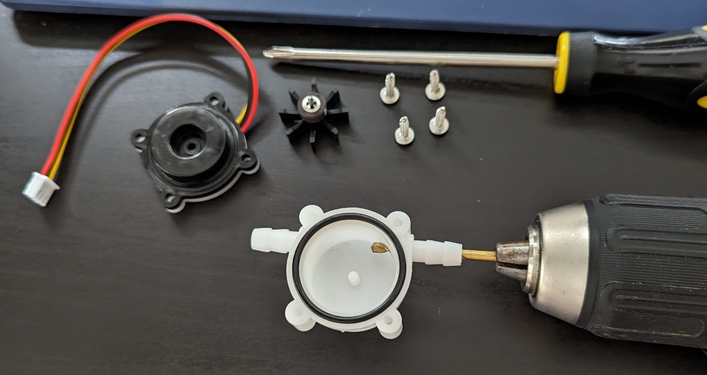
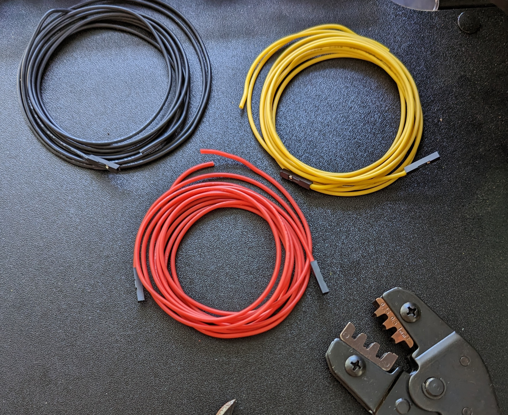
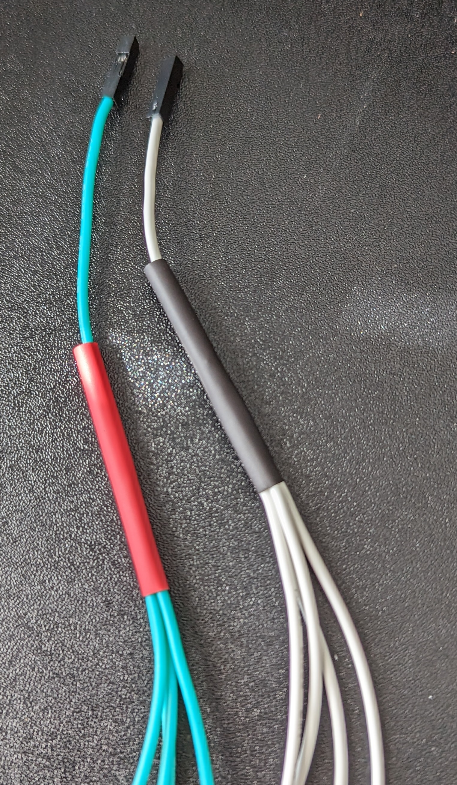
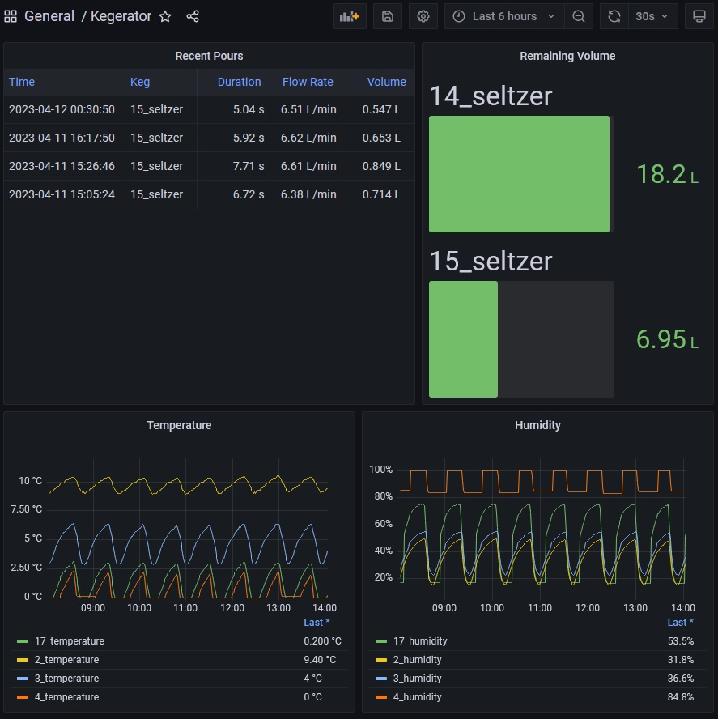

<!-- summary -->
The kegerator has a new gas line and we're ready to get started installing some sensors. The goal with these sensors is to keep track of how much seltzer I've got left and how long it takes the fridge to cool down kegs that have been refilled with room-temperature water.
<!-- summary -->

[https://github.com/subtlepseudonym/kegerator](https://github.com/subtlepseudonym/kegerator)


Taken by [Martin Adams](https://www.instagram.com/nitramadams/)


## Hardware
- raspberry pi zero w
- micro-usb to AC power cable
- small command strips
- 2 flow sensors (digiten fl-s401a or gredia gr-r401)
- 4 dht22 sensors
- wire & female dupont connectors
- crimping tool
- heatshrink
- soldering iron
- something to write software on

## Getting ready
The first thing to do is ensure that all our components function and give _reasonably_ accurate results. The DHTs (for sensing temperature and humidity) ostensibly require calibration, but I've found them to be accurate enough right out of the packaging. As for the flow meters, we just need to make sure that they work; they'll require calibration each time you run a different liquid through them.

> Setting up the raspberry pi is outside the scope of this article. If you'd like a walkthrough of that process, the first part of [this article](https://subtlepseudonym.com/articles/k8s-on-pi/) includes one.

### DHTs
The simplest to set up are the temperature / humidity sensors: connect the sensors to any available GPIO pins and run some test code to get a few measurements out of them.

The repo linked above contains some code for testing the sensors. You'll need a golang and docker build environment in order to compile it.
```bash
git clone https://github.com/subtlepseudonym/kegerator.git && cd kegerator
make build
scp bin/sensor-test $USER@$RASPI_HOST:/home/user/sensor-test
ssh $USER@$RASPI_HOST
/home/user/sensor-test --dht $PIN_NUM
```

### Flow meters
Setting up the flow meters is a similar process, but they need to be modified a bit. As-is, the flow meters have a very small diameter hole on the input side. This restricts the flow rate significantly and gets us nowhere near the ~5L/min rate we want from our taps. To fix this, it's back to drilling. 

To avoid damaging the spinning wheel inside the flow meter, we should take the device apart and drill only the back shell. A 1/8" bit fits perfectly, although it's a good idea to run it back and forth for a while to ensure we don't have any hanging plastic bits.



Once the drilling is done, it's time to test the sensor output. I suggest connecting a short length of hose to the input end of the flow meter so it's easier to keep water away from the electronics.

## Wire work
I initially tried installing everything with short lengths of wire between each component and it made replacing empty kegs a frustrating endeavour. In my experience, signal transmission is fine over a couple feet, so we're safe to run wire across the ceiling and walls of the fridge to keep things tidy.



The raspberry pi only has two 5v and two 3v3 GPIO pins. In order to support 2 flow meters and 4 DHTs, we need to combine some of the wires. In this case, I soldered both the DHT power and ground cables into 4-to-1 connections and crimped a female dupont connector onto the end.



## Installation
Installing the raspberry pi and dht22 modules is as simple as sticking each to a command strip, tacking that to the inside wall of the kegerator, and running some wire between the two. The flow meter installations are a bit trickier; they need to be run in-line with the beverage hoses.


Fitting a 1/4" barb into a 3/16" ID hose is easiest if you heat up the hose first. The most convenient method I've found is dipping the end of the hose into some hot water for 30 seconds or so. For a short while afterwards, the line is pliable enough that the 1/4" barb can be inserted without too much effort, forming a really tight seal. In my case, the seal was tight enough that I didn't need to use worm clamps.


In my case, the seal was tight enough that I didn't need to use worm clamps


After adding some packing tape to keep the wiring in place, we're all set!


Re-enacting the climax of Event Horizon in my fridge


## Updating the software
The sensor-test code is great for making sure the sensors work, but leaves a lot to be desired in terms of actually monitoring the kegerator. I run [prometheus](https://prometheus.io/) and [grafana](https://grafana.com/) instances on my network, so the simplest way to get state information from the raspberry pi into a human-readable form is by publishing prometheus metrics and setting up a grafana dashboard to display them. Along with some concerns around tuning flow constants and refilling kegs without restarting the program, I assembled a short list of design goals:
- Load any mutable state from a config file
- Maintain that state in memory so we can query it
- Publish state periodically for prometheus

Those goals precipitated the following data structures:
```golang
type KegState struct {
	Keg struct {
		Type   string  // "corny", "sixtel", etc
		Volume float64 // in liters
	}
	Sensor struct {
		Model        string  // "fl-s401a", "gr-r401", etc
		FlowConstant float64 // in 1/(60 * liters)
	}

	Contents string  // "seltzer", "jai alai", etc
	Pin      int     // gpio pin number
	Poured   float64 // in liters
}

type DHTState struct {
	Model       string  // "dht22"
	Pin         int     // gpio pin number
	Temperature float32 // in degrees centigrade
	Humidity    float32 // in percent
}
```

These structures are the representations of the flow meters and temperature / humidity sensors as they are read from a config file and as they're exported on the `/state` HTTP endpoint. The internal representations are a bit more complex in order to handle concurrent updates, live config reloads, and store information on discrete pours. That last feature actually comprises a significant portion of the flow meter update logic (and most of the bugs) despite being an unplanned feature that I just thought was neat. If you're curious, the discrete pour logic can be [found here](https://github.com/subtlepseudonym/kegerator/blob/00210a010fde41f6788851a82bf36740a3f93ae8/flow.go#L203).

> Note: The flow constant `k` has a unit of $1 \over 60L$ because it's intended to make $liter \over minute$ flow rate measurements easier. We can calculate how many liters have been detected _per signal pulse_ from the sensor by calculating $1 \over 60k$.

## Displaying in grafana
Using metrics for total volume poured, temperature, humidity, and the `/pours` endpoint, we can create a dashboard containing all the kegerator state information we need.



> You may have noticed that something's up with the DHT on pin 4. It tends to freeze for ~40 minutes out of every hour and doesn't report great data as a result. I could move it to extend the life of the sensor, but the 20 minutes of okay data it produces each hour gives me some insight into the coldest part of the fridge.

## Mistakes and experiments
During the course of this project, plenty of different approaches were explored and mistakes were made. Here are a few of the more interesting examples.

### Bad calibration
Calibrating the uxcell with still water turns out to have been a bad idea. When the keg was kicked, it had measured ~21.369L dispensed, which is unlikely for a 18.93L keg. That's an error rate of ~12.9%: much higher than the advertised 3% accuracy rating. This issue is "technically" fixed by the live config reloads, but those get tricky in that the program is periodically writing state information to the config file that needs to be edited. I solved the problem by including a `/calibrate` HTTP endpoint.

### Signal leakage
The uxcell flow meter is putting off enough RF that the digiten is picking it up and recording phantom pours. I was unsure if this was the uxcell poorly regulating voltage (i.e. just dumping modulated pulses from power into signal) or if it was a result of using a longer wire for the uxcell. I tested this by installing a gredia (which has greater accuracy anyway) in place of the uxcell. This solved the issue despite using even longer wires.

### Flow rate problems
The digiten / gredia sensors flow poorly (compared to no flow meter) and the uxcell flows _really_ poorly. Flow rate degrades from something like 4-5L/min without a sensor down to 1.2 or 1L/min with a sensor. To illustrate, it takes about 30 seconds to fill a ~0.8L glass. I tried using a gredia with 3/8" thread (due to larger internal aperture) by jury-rigging a 3/8" thread to 1/4" barb adapter. The sensor has BSPT thread and the adapter has NPT, with predictable results: it leaked everywhere at seltzer pressure (~22psi). I fixed the issue by drilling out the plastic inflow tube on the original 1/4" barb sensor. The flow rate is fixed, but sensor is less sensitive (by roughly half).

### Running in docker?
I'm a big fan of writing with the intention to run in docker; it's portable and makes any assumptions about the running of the code explicit. Unfortunately, docker is very slow running on the pi and, for a reason I haven't fully investigated, doesn't close the gpio pin connections. It mostly causes issues when I forget about it and restart the program, resulting in "pin in use" error messages. I'm avoiding the issue by running natively.
