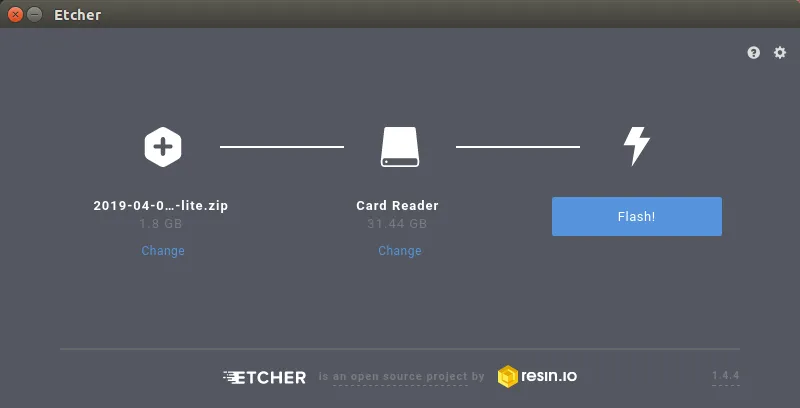

If you have a few raspberry pis lying around and you're looking for an interesting way to get started with kubernetes, this is the tutorial for you! Below, I've outlined a fairly straight forward method for getting a stripped down install of kubernetes (k3s) installed across a pair of raspberry pis.

> While I was working on this project, I realized that one of my pis was corrupting sd cards. It took me a while to realize that the pi itself was the culprit, so I ended up spending quite a bit of time flashing new raspbian images and getting fresh installs set up with some basic tools. I wrote a script to do most of the work, so this will be a relatively quick tutorial with a minimum of non-kubernetes related setup tasks.

### Things you'll need:
- Two raspberry pis (with sd cards)
- Two ethernet cables
- A network switch
- A stable internet connection
- About an hour

### Flash your raspberry pi
Start by flashing raspbian onto the raspberry pi sd cards. I used the April 2019 release of raspbian from the [official downloads page](https://www.raspberrypi.com/software/) and [etcher](https://www.balena.io/etcher) to flash the cards.



Log into your first pi (we'll refer this as `node1`). The default user:pass is `pi:raspberry`. Next run `sudo raspi-config nonint do_ssh 0`, which enables remote ssh access.

If you do not have your pi connected to a monitor and keyboard or simply don't have physical access to it, add an empty file at /boot/ssh to the sd card before inserting it into the pi. [This will enable ssh on first boot](https://www.raspberrypi.com/news/a-security-update-for-raspbian-pixel/).


The easiest way to do this is by attaching a monitor and a keyboard to your pi


A fun note about this command --
> The raspi-config binary doesn't have an official non-interactive API, so this command may not work in the future. You can either use the interactive mode by omitting `nonint do_ssh 0` and using the GUI or by looking [at the source](https://github.com/raspberrypi-ui/rc_gui/blob/master/src/rc_gui.c) and updating the command. In case the link to source above is broken, you can also check [an archive of the page](https://web.archive.org/web/20200718051303/https://github.com/raspberrypi-ui/rc_gui/blob/master/src/rc_gui.c).

### Get the setup script
Run `wget https://raw.githubusercontent.com/subtlepseudonym/pi/master/setup/pi_raspbian.sh`, which will download a setup script that will set your hostname, create a non-default user, and install some useful packages.


This gif has been truncated to maintain readability


> This script is fairly opinionated and will set up some basic directories and change your default shell. I recommend reading through the script before running it and tailoring it to your use case.

### Run the setup
Add executable permissions to the setup script with `chmod +x setup.sh` and run it with `sudo ./setup.sh HOSTNAME USERNAME` with a hostname and username of your choosing. For this example, we'll use `node1` as the hostname and `user` as the username.

You will be prompted for a password and then you can go get a coffee, because it takes a few minutes to set things up. When the script is finished, your pi will reboot.


Notice the user@host change from the previous gif


`ssh` into the pi and run the cleanup script via `sudo ./cleanup.sh`. This removes the default pi user and its home directory.


### Install k3s
We'll be using [k3s](https://github.com/k3s-io/k3s), a stripped-down version of kubernetes. Download the install script with `curl -sfL https://get.k3s.io | sh -`. This will install k3s and get it started as a system service.


Congratulations! Your first pi is all set.

> If you run into trouble, you can check the status of the k3s service with `systemctl status k3s`. You can also uninstall k3s using `/usr/local/bin/k3s-uninstall.sh`.

### Set up your second node
Repeat these steps on the second pi (`node2`), stopping before the k3s installation. We don't need the whole server, so we're just going to install the k3s agent.

First, get the node token from node1 with the following:
`sudo cat /var/lib/rancher/k3s/server/node-token`.

Next, run the following command, replacing `$NODE1_IP` and `$NODE_TOKEN` with the IP address of `node1` and the output of the `cat` command above.

```bash
curl -fsL https://get.k3s.io | K3S_URL=https://$NODE1_IP:6443 K3S_TOKEN=$NODE_TOKEN sh -
```

This will get the k3s agent started on `node2` and register it with your k3s server on `node1`.

> If you run into trouble, try checking the status of the k3s agent service with `systemctl status k3s-agent`. In the worst case, you can uninstall and reinstall the k3s agent using `/usr/local/bin/k3s-agent-uninstall.sh` and the command you used above to install the agent. If you do uninstall and reinstall, be sure to remove the password entry corresponding to `node2` on `node1` in `/var/lib/rancher/k3s/server/cred/passwd`.

### Test your cluster setup
So long as `node1` is discoverable by `node2`, your kubernetes cluster should now be set up! You can confirm this by running `k3s kubectl get nodes` on `node1` and ensuring that both `node1` and `node2` are listed


---

Now that you have a working kubernetes cluster, you're free to write up a manifest and get your software running resiliently! If you're looking for a more specific suggestion, check out my article on running pi-hole on your new cluster.
