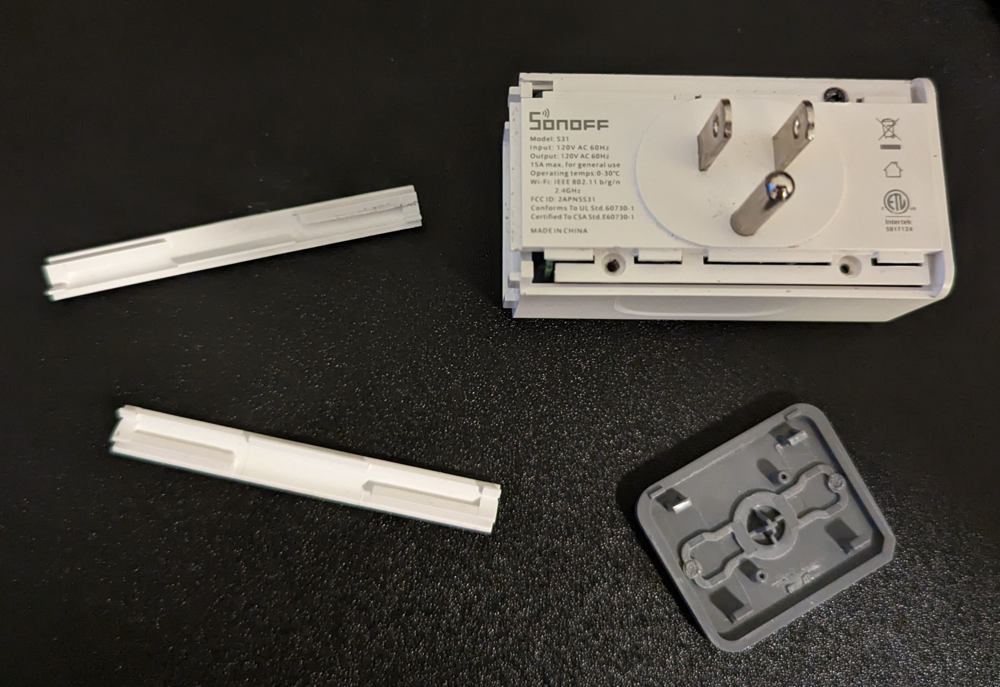
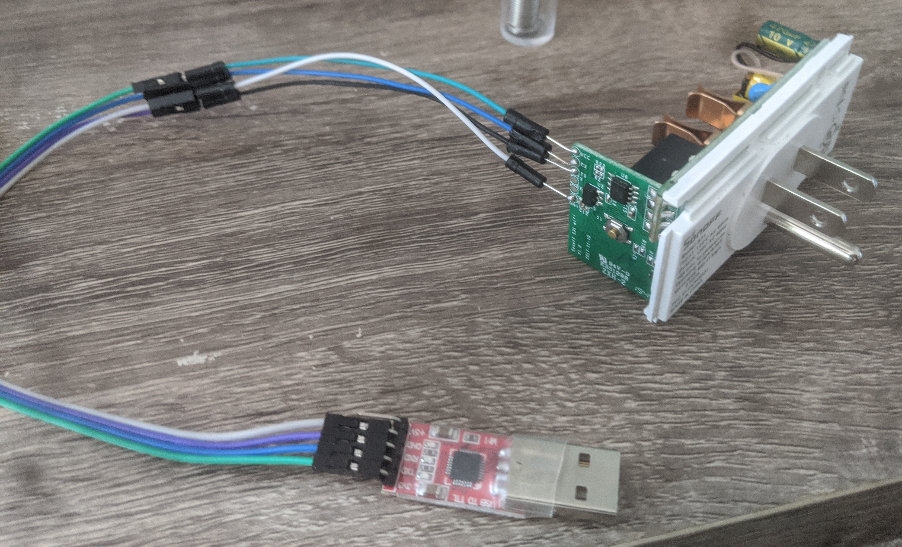
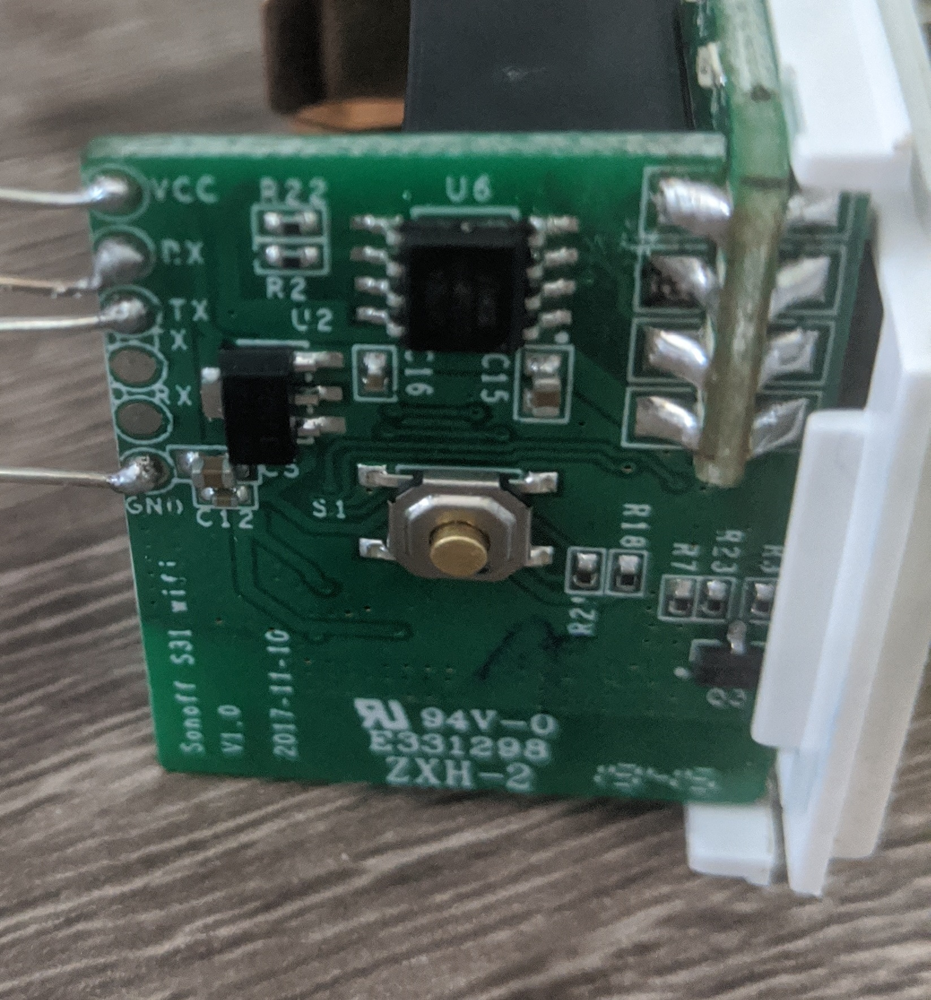
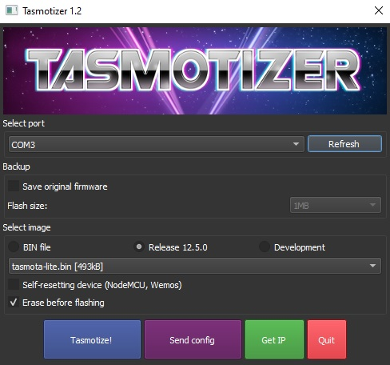
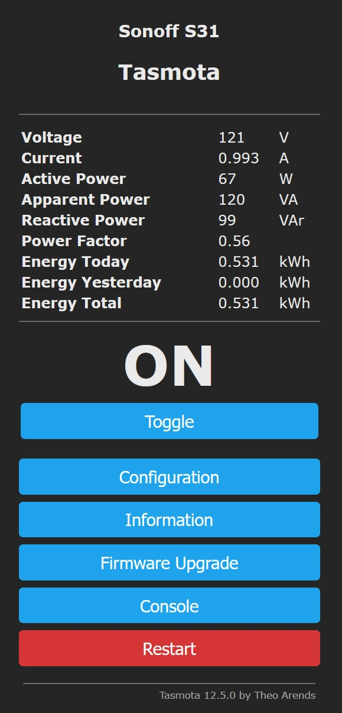
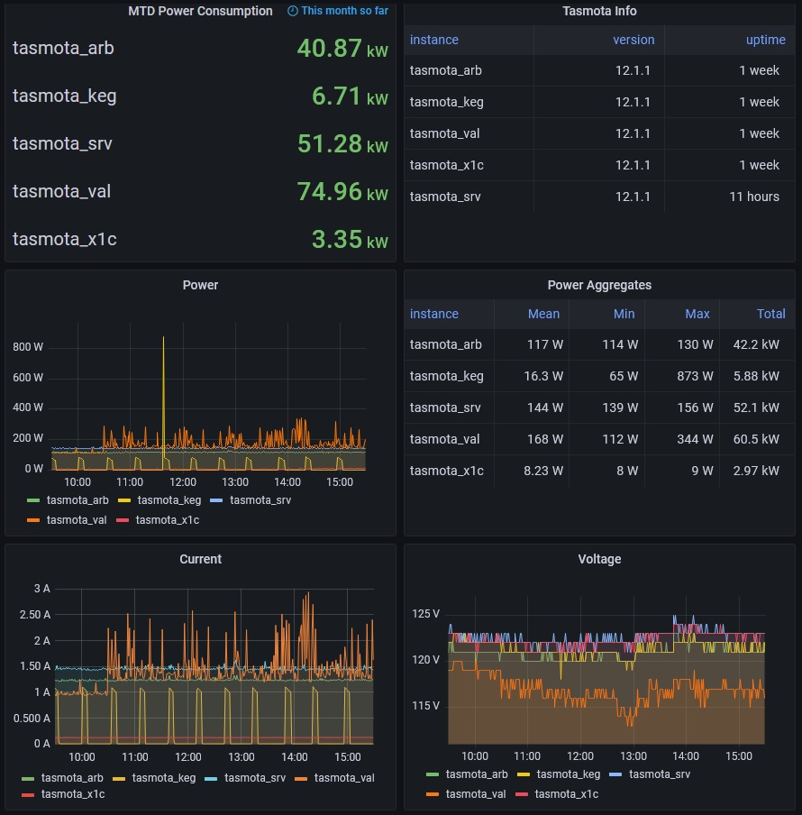

I run both a server and a small cluster of raspberry pis at home, in addition to some networking equipment. This (probably) represents a significant amount of my power usage. The problem is, I know these things tend to be power-hungry, but I don't know _exactly how much_ power they're really drawing. To remedy this, I spend some time setting up power monitoring IoT plugs.

## What we'll need
- [Sonoff S31](https://sonoff.tech/product/smart-plugs/s31-s31lite/) (or any esp8266 based plug with power monitoring)
- [USB to TTL adapter](https://www.amazon.com/IZOKEE-CP2102-Converter-Adapter-Downloader/dp/B07D6LLX19) (for flashing the S31)
- [jumper wires](https://www.amazon.com/EDGELEC-cables-alambre-Dupont-colores/dp/B07GD2BWPY) (you can never have too many of these)
- [soldering iron](https://www.amazon.com/Liouhoum-Auto-Sleep-Adjustable-Temperature-Thermostatic/dp/B08PZBPXLZ) and [solder sucker](https://www.amazon.com/Teenitor-Solder-Sucker-Desoldering-Removal/dp/B0739LXQ6N)

That list puts the cost of this project around $35-60 depending upon whether you already have access to a soldering kit. I also used a stand with a magnifying glass and alligator clips [like this](https://www.amazon.com/Double-Third-Clamp-Alligator-Magnifying/dp/B006ZBJU04) to make holding wires together a bit easier.

## Opening the S31
We need to access the serial contacts on the S31. To do that, we need to take it apart. For this step, I found [this tutorial](http://www.phreakmonkey.com/2018/01/sonoff-s31-disassemble-and-flash.html) extremely useful. On my device, the screws were made of very soft metal and stripped quite easily. You may want to have a [screw extractor](https://www.lowes.com/n/how-to/remove-a-stripped-or-broken-screw) drill bit on hand. I've paraphrased the disassembly steps below:

1. Remove the darker plastic panel with the power button. It should come off easily if you pry at it carefully.
2. Slide out the plastic rails on the top and bottom corners, on the side with the male plug.
3. Unscrew the three screws that were conceled by the plastic rails.
4. The two parts of the case should now separate easily.



## Attach the serial connection
>*Note*: Be absolutely certain that the S31 *is not* plugged in or powered in any way. The ground pin is connected to the live AC wire and it will electrocute you or fry your computer if it's plugged into the wall.

Next, solder the jumper wires to the S31. The contacts we care about are labelled *vcc* (3v3 power), *rx* (receive), *tx* (transmit), and *gnd* (ground).

The S31 has two sets of rx-tx contacts. The pair closer to *gnd* isn't connected to anything. Solder the jumper wires to the rx-tx pair closer to *vcc*. If you're having trouble heating the ground contact, try carefully increasing the heat on your soldering iron or using a tip with more surface area.

Let everything cool off, then attach the jumper wires to the usb-to-ttl adapter. Using the adapter linked in the first section, connect the labelled contacts as follows (formatted as `S31 to adapter`):
- vcc to 3v3
- rx to tx
- tx to rx
- gnd to gnd



Double check that you're attached to 3v3 power, *not* 5v. Powering the S31 with five volts will turn it on, but may damage the onboard wifi module.

## Flashing custom firmware
We'll be flashing the plug with [tasmota](), which is open source and feature rich. Before we can do that though, there are two stumbling blocks: the default release doesn't include a prometheus exporter and the S31 doesn't have enough memory to directly flash the binary we're going to compile. So, we have to load the firmware using the following steps:

1. Clone the tasmota repo and compile the firmware with a custom configuration
2. Flash the S31 with the tasmota-lite release
3. Perform an OTA firmware update to the binary we compiled

>Note: The tasmota project has been in active development since the writing of this article, so you may be able to skip the tasmota-lite install and instead flash the custom compiled binary directly

### Compiling tasmota
>Below, I've linked to the docker-tasmota repository because it reduces the required software for compiling the firmware. If you'd prefer to compile using native tools, you can find the repository [here](https://github.com/arendst/tasmota)

After we've cloned [the docker-tasmota repo](https://github.com/tasmota/docker-tasmota), we need to edit the file named `user_config_override.h` in the project root directory. In this file, we're going to define our wifi network information and pass some configuration options. The contents of the file should include _at least_ the following lines:

```c
#ifndef _USER_CONFIG_OVERRIDE_H_
#define _USER_CONFIG_OVERRIDE_H_

// set up your wifi name and password
#undef  STA_SSID1
#define STA_SSID1  "your wifi ssid"

#undef  STA_PASS
#define STA_PASS   "your wifi password"

// disable some default features we don't need
#undef  USE_DOMOTICZ
#undef  USE_HOME_ASSISTANT

#define USE_PROMETHEUS

#endif
```

We want to compile firmware with support for power monitoring sensors as well as our custom config, which can be done with the following command:
```bash
./compile.sh tasmota-sensors
```

### Flashing minimal firmware
First, hold down the small button that can be found next to the GPIO contacts you soldered earlier and plug the usb-to-ttl adapter into your computer. This will put the S31 into flashing mode and allow us to load new firmware.



There are several ways to flash this board, but I found the simplest to be using [tasmotizer](https://github.com/tasmota/tasmotizer). Check the `Release` radio button and choose `tasmota-lite.bin` from the dropdown. Ensure that `Erase before flashing` is true and we're ready to flash!



### Flashing custom firmware
The OTA firmware update should be relatively straight-forward. Start by connecting to the web UI using the IP address of the S31 (ex. `http://192.168.1.150/`). In the web UI, click `Firmware Upgrade`, upload the firmware binary we compiled earlier, and start the upgrade.

Once the upgrade is finishing, we can finish off the configuration details in the web UI. From the main menu, select `Configuration`, `Configure Module`, and choose `Sonoff S31` from the dropdown.

## Verify power monitoring
Now that the plug is fully set up, we can verify that power monitoring is functioning properly by plugging it into the wall and connecting a lamp to it. Pulling up the web UI again, we can verify that sensor measurements are available at the top of the main page.



>Prometheus metric output can be verified at the `/metrics` endpoint at the same address used to access the web UI.

## Graphing power usage
With the plug connected and metrics flowing, we can set up the S31 as a prometheus target and begin querying those power stats!


