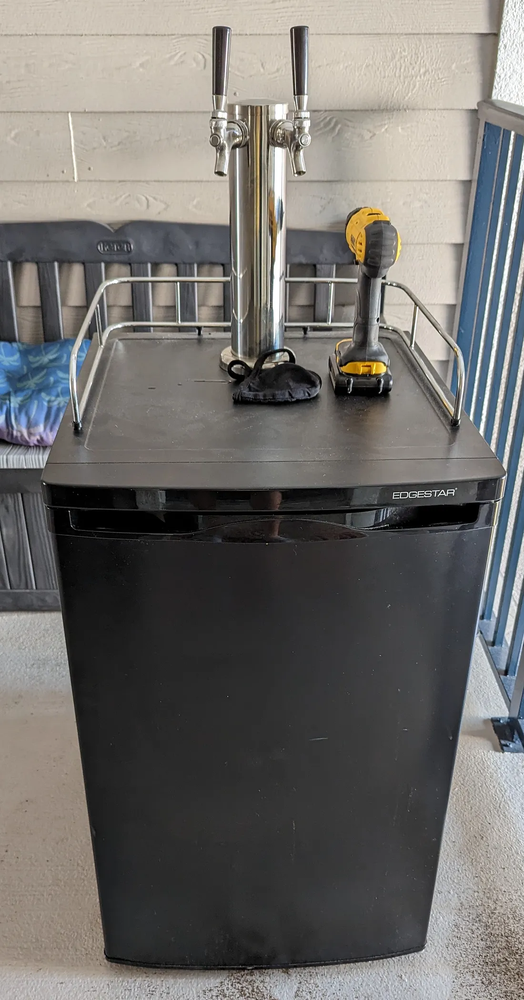
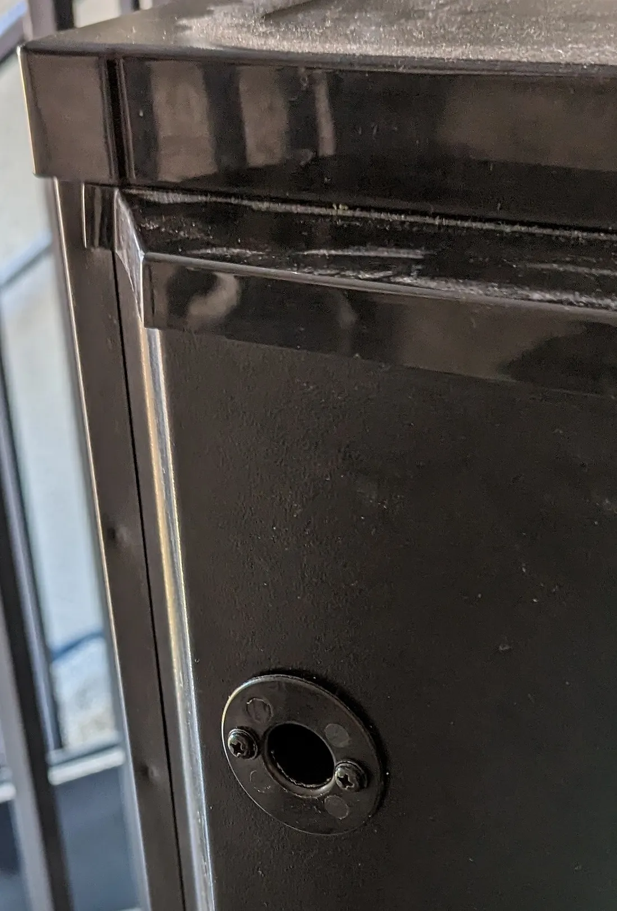
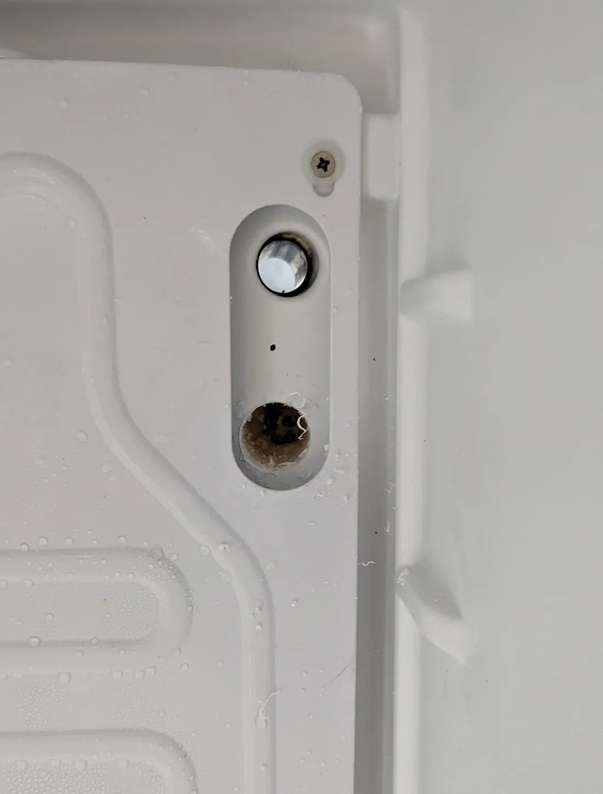
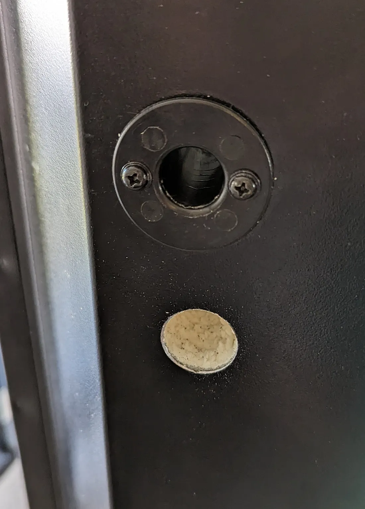
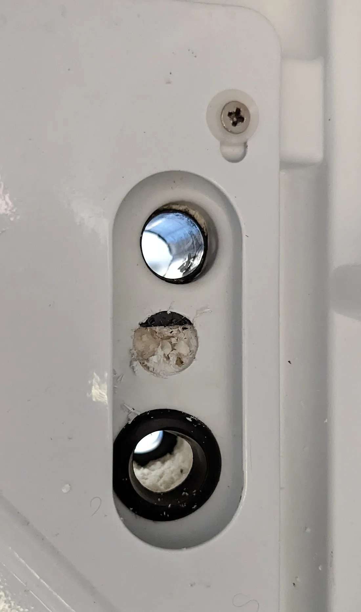
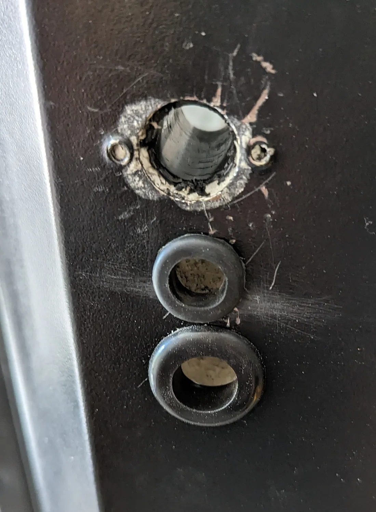
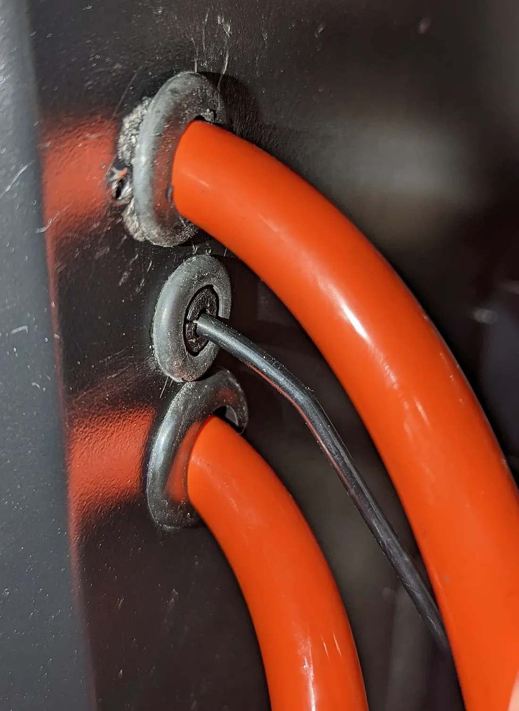

I was recently gifted a dual pressure gas regulator, so it's time to upgrade my kegerator.

For this project, I have a pair of upgrades in mind:
- Add a second gas line to make use of the new regulator
- Install some sensors to monitor how much liquid is left in each keg

Strictly speaking, neither of these things are actually required to achieve high-availability seltzer, but belie some broader goals. I'd like to occasionally serve beer alongside the usual seltzer, which should be served at a different pressure, and I'd like to know how much is remaining in either keg (without opening the door and judging heft).

In this article, we'll cover adding that second gas line as well as cutting a utility hole for powering the sensors. A following article will cover installing the sensors and monitoring keg state.

### The Hardware

- [kegerator](https://www.edgestar.com/edgestar-full-size-kegerator-keg-beer-cooler/KC2000.html) (EdgeStar KC2000)
- [dual pressure gas regulator](https://www.amazon.com/Pressure-Regulator-Regulators-Kombucha-Connection/dp/B07D8J7NDC)
- sufficient lengths of gas and beverage line ([5/16" ID](https://www.kegoutlet.com/hose-gas-hose-red-5-16-id-9-16-od.html) and [3/16" ID](https://www.kegoutlet.com/hose-beer-hose-clear-3-16-id-x-7-16-od.html))
- power drill
- [7/8" hole saw](https://www.lowes.com/pd/LENOX-7-8-in-Bi-Metal-Arbored-Hole-Saw/1003054082)
- [5/8" drill bit](https://www.lowes.com/pd/DEWALT-5-8-in-x-Standard-Twist-Drill-Bit/3420094) or hole saw
- 2x rubber grommets (1–1/8"OD x 5/8"ID)
- rubber grommet (31/32"OD x 1/2"ID)
- 2x rubber grommets (13/16"OD x 1/2"ID)

> A quick note about the grommet sizes: They're sized according to their outer diameter rather than the outer diameter of the hole they're intended to fit. For these particular parts, the rubber rim is roughly 1/8" thick (contributing 1/4" to the diameter), therefore fitting a 7/8" hole.

### Drilling the first hole

Ostensibly, drilling holes is pretty easy. The catch is that refrigerators tend to be full of wiring and coolant, of which the latter is flammable, so we'll need to be careful.

Inside the fridge, the cold plate has a pill-shaped cutout where the existing gas line feeds through the rear wall. The cutout is much larger than the existing hole and certainly _looks_ like it's been designed to support expansion. [A few folks on the internet](https://www.homebrewtalk.com/threads/adding-a-second-gas-line-to-a-edgestar-kc2000twin.347217/) have had success with adding new holes too. With those factors in mind, I decided to carefully drill out the inside wall.

The inside wall is fairly thin and made from plastic, so it cut easily with the hole saw. To start, I drilled through the plastic _only_ and poked a pen into the insulation on the other side to ensure that there wasn't anything hidden within. Finding nothing, I bored out the remaining insulation.

I then returned to the rear panel to make the second cut from the outside. The metal isn't very thick, but some patience was required to do this cleanly. Finally, I finished the new holes with rubber grommets to prevent wear on the gas lines and provide a tighter seal.

> Note: The hoses I'm using for CO₂ are 9/16"OD. If you're using a different size, you may have trouble finding grommets that both fit a 7/8" hole and provide enough clearance for the hose. Also, the existing gas line runs through a 6/8" hole rather than the 7/8" we're drilling, hence the 31/32"OD x 1/2"ID grommet in the parts list.

### Here we go again

With the new gas line ready to go, it's time to drill a "utility" hole to power the sensors that we'll install later. The AC adapter I've got has a 5/8" [RF choke](https://en.wikipedia.org/wiki/Ferrite_bead) that we'll have to feed through the hole, so it'll need to be at least that wide.

Unfortunately, drilling the second hole did not go as smoothly as the first. Upon cutting through the inner wall, I encountered some soft black plastic that I worried could be some wiring. Using a pocket knife, I pared it down a small amount at a time, intending to seal it back up should I find wiring, but found it to be one solid chunk. Satisfied, I bored the rest of the way through and finished up the utility hole.

I removed the plastic liner from the original hole because it was too wide to accomodate the utility hole grommet.

Now all that's left to do is run the lines, put the sensors in place, and find something to plug the gap between the 1/8" power cable the 1/2" hole it runs through.

For the final item, I modeled and 3D printed a part to wrap the power cable and plug the hole exactly. I'm unsure how well PLA insulates, but it fits the gap nicely and doesn't look half bad.

> If you have access to a 3D printer and would like the model file for the part, send me an email: subtlepseudonym(at)gmail.

### Conclusion

With the hoses connected, our first goal is complete! We can now serve two beverages simultaneously, each at different pressures. We're also positioned to start work on installing sensors now that we've got a power cable running into the fridge.

In this stage of the project, we drilled two holes in the rear of the kegerator: one for a second gas line and one for a power cable. We also covered installing rubber grommets and producing a plastic part that wraps the power cable and plugs the second hole.

In the following stage, we'll cover installing flow, temperature, and humidity sensors as well as writing some software to collect and surface that information.

> In the meantime, the code can be [found here](https://github.com/subtlepseudonym/kegerator) and I'll replace this note with a link to the second article once it's finished.
